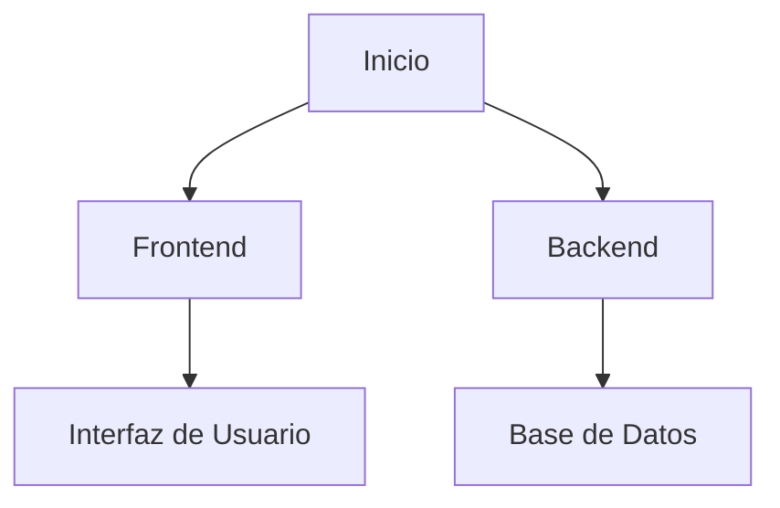
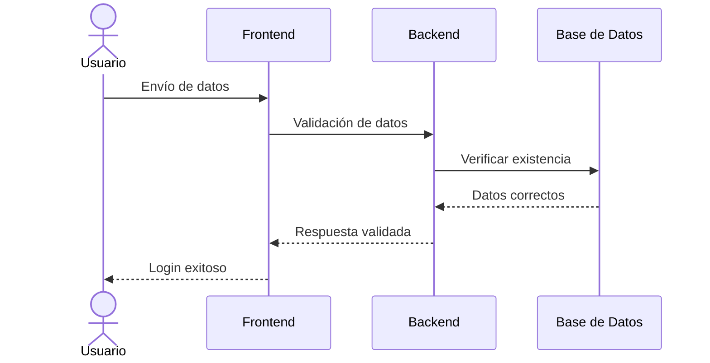

# <center>Motix</center>

¡Bienvenidos a nuestro proyecto final de grado! :mortar_board::rocket:

En este repositorio encontrarás toda la información sobre nuestro trabajo, en el que hemos invertido esfuerzo, creatividad y conocimiento para desarrollar una solución innovadora.

---

## :book: Índice
1. [Descripción del Proyecto](#descripción-del-proyecto)
2. [Tecnologías Utilizadas](#tecnologías-utilizadas)
3. [Instalación y Uso](#instalación-y-uso)
4. [Arquitectura del Proyecto](#arquitectura-del-proyecto)
5. [Desarrollo del Proyecto](#desarrollo-del-proyecto)
6. [Video Promocional](#video-promocional)

---

## :pushpin: Descripción del Proyecto
<a name="descripción-del-proyecto"></a>

Motix es la solución integral para la gestión de logística y ventas, diseñada para satisfacer las necesidades de las empresas modernas. 
Con una **interfaz moderna y centrada en la simplicidad** :computer:, Motix permite a las empresas **optimizar sus procesos logísticos, gestionar inventarios, realizar seguimientos de envíos :truck: y procesar ventas** de manera eficiente y segura.

Nuestra plataforma ofrece una serie de **características avanzadas** que incluyen la **automatización de tareas repetitivas**, lo que permite a las empresas **ahorrar tiempo y reducir costos operativos**. :stopwatch: La **seguridad de los datos** :lock: es una prioridad en Motix, utilizando las últimas tecnologías para garantizar que la información de nuestros clientes esté siempre protegida.

Además, Motix es **accesible desde cualquier lugar del mundo con acceso a internet** :earth_africa:, lo que garantiza la continuidad del negocio y la flexibilidad necesaria en el entorno empresarial actual. Con Motix, las empresas pueden centrarse en lo que realmente importa: **hacer crecer su negocio y satisfacer a sus clientes.**

> "La mejor manera de predecir el futuro es crearlo." – Peter Drucker

---

## :hammer_and_wrench: Tecnologías Utilizadas
<a name="tecnologías-utilizadas"></a>


Hemos utilizado diversas tecnologías para el desarrollo de este proyecto, incluyendo:
- ***GitHub*** para la gestión del código :hammer_and_wrench:
- ***AWS*** para el despliegue en la nube :cloud:
- ***Java*** para el desarrollo backend :coffee:

---

## :rocket: Instalación y Uso
<a name="instalación-y-uso"></a>

Sigue estos pasos para instalar y ejecutar el proyecto:
```bash
# Clonar el repositorio
git clone https://github.com/usuario/proyecto-final.git

# Acceder al directorio
cd proyecto-final

# Instalar dependencias
npm install

# Ejecutar el proyecto
yarn start
```

---

## :triangular_ruler: Arquitectura del Proyecto
<a name="arquitectura-del-proyecto"></a>

A continuación, se muestra un diagrama que ilustra la arquitectura general del proyecto:



---

## :wrench: Desarrollo del Proyecto
<a name="desarrollo-del-proyecto"></a>

| Módulo         | Descripción                                      | Tecnologías Utilizadas | Estado       | Fecha de Inicio | Fecha Estimada de Finalización |
|----------------|--------------------------------------------------|------------------------|--------------|-----------------|--------------------------------|
| Markdown       | Diseño y exposición del proyecto y los pasos     | Markdown               | Completado   | 2025-02-01      | 2025-02-09                     |
| Base de Datos  | Diseño y gestión de la base de datos             | AWS                    | En progreso  | 2025-02-28      | 2025-03-15                     |
| Autenticación  | Gestión de usuarios y autenticación              | Java                   | Pendiente    | 2025-03-16      | 2025-03-31                     |
| Frontend       | Desarrollo de la interfaz de usuario             | JavaFX                 | Pendiente    | 2025-04-01      | 2025-04-15                     |
| Integración    | Integración de servicios externos (pagos, envíos)| DHL API                | Pendiente    | 2025-04-16      | 2025-04-30                     |
| Testing        | Pruebas unitarias y de integración               | JUnit                  | Pendiente    | 2025-05-01      | 2025-05.15                     |

Diagrama de secuencia



    
---

## :articulated_lorry: Video Promocional
<a name="video-promocional"></a>

[](https://www.youtube.com/watch?v=4qDOnB9bWzQ)

---

:sparkles: _Gracias por visitar nuestro repositorio y ser parte de este proyecto!_ :rocket:
