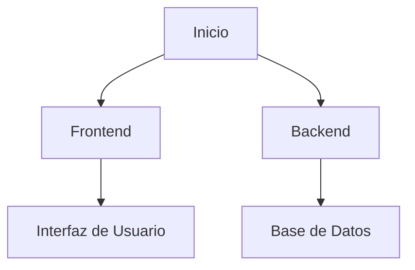

# 📌 Proyecto Final de Grado

¡Bienvenidos a nuestro proyecto final de grado! 🎓🚀

En este repositorio encontrarás toda la información sobre nuestro trabajo, en el que hemos invertido esfuerzo, creatividad y conocimiento para desarrollar una solución innovadora.

---

## 📖 Índice
1. [Descripción del Proyecto](#descripcion-del-proyecto)
2. [Tecnologías Utilizadas](#tecnologias-utilizadas)
3. [Instalación y Uso](#instalacion-y-uso)
4. [Arquitectura del Proyecto](#arquitectura-del-proyecto)
5. [Contribuciones](#contribuciones)
6. [Licencia](#licencia)

---

## 📌 Descripción del Proyecto

Nuestro proyecto tiene como objetivo **[breve resumen del propósito del proyecto]**. Nos hemos basado en las mejores prácticas de desarrollo para garantizar un producto sólido y escalable.

---

## 🛠️ Tecnologías Utilizadas


Hemos utilizado diversas tecnologías para el desarrollo de este proyecto, incluyendo:
- **Markdown** para la documentación 📜
- **Mermaid** para los diagramas 📊
- **GitHub** para la gestión del código 🛠️

---

## 🚀 Instalación y Uso

Sigue estos pasos para instalar y ejecutar el proyecto:
```bash
# Clonar el repositorio
git clone https://github.com/usuario/proyecto-final.git

# Acceder al directorio
cd proyecto-final

# Instalar dependencias
npm install

# Ejecutar el proyecto
yarn start
```

---

## 📐 Arquitectura del Proyecto

A continuación, se muestra un diagrama que ilustra la arquitectura general del proyecto:



---

## 🤝 Contribuciones

¡Las contribuciones son bienvenidas! Si deseas colaborar con nuestro proyecto, sigue estos pasos:
1. Haz un fork del repositorio 🔄
2. Crea una nueva rama (`git checkout -b feature/nueva-funcionalidad`) 🌿
3. Realiza tus cambios y confirma los cambios (`git commit -m 'Añadir nueva funcionalidad'`) 📌
4. Sube los cambios (`git push origin feature/nueva-funcionalidad`) 🚀
5. Abre un Pull Request 📩

---

## 📜 Licencia

Este proyecto está bajo la licencia MIT. Para más información, consulta el archivo `LICENSE`.

---

✨ _Gracias por visitar nuestro repositorio y ser parte de este proyecto!_ 🚀
